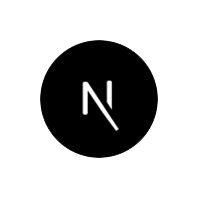

<p align="center">
  
    
</p>

<h2 align="center">
  <big><strong>Nextjs & ChakraUI - Nami Wallet Integration</strong></big>
</h2>


<hr/>

This is a [Next.js](https://nextjs.org/) + [Chakra UI](https://chakra-ui.com/docs/) project bootstrapped with this [`nextjs-chakra-boilerplate`](https://github.com/MiCurran/nextjs-chakra-boilerplate).

### Disclaimer  
*Disclaimer: This software is provided as-is with no warranty. I take no responsibility for lost funds while using this system.*

## Getting Started  
  
  ## You will need an API key from [blockfrost.io](https://blockfrost.io) in order to retrieve details about the Cardano blockchain  

First, install dependencies:

```bash
npm install
# or
yarn install
```  
  
Next, your Blockfrost API key to a `.env.local` file as shown in `.env.local.example`  

Then, run the dev server:

```bash
npm run dev
# or
yarn dev
```  

This repository also contains a script to create components in the `./components` directory. Just use:  

```bash
./createComponent.sh -a ComponentName
```

Open [http://localhost:3000](http://localhost:3000) with your browser to see the result.

## Ada Donation Address:  
`addr1qxdkm6ha9rxsj3r6upfqcwkt5xreu5djr6cgwv2uq4twng2x37st629maarc2dw4w0waapy266z54zmmnfh0ut5dkcrs2qnwgx`

